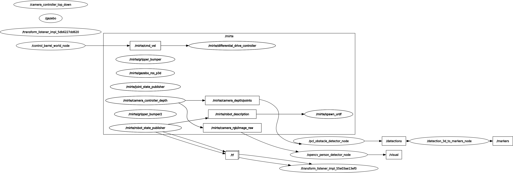

The project implements an autonomous navigation system for a Mirte robot in a Gazebo-simulated environment. The robot is capable of detecting obstacles using point cloud data and navigating around barrels and pedestrians to achieve its objectives.

## Key Features

- **PCL-based Obstacle Detection**: Processes depth camera data using Point Cloud Library (PCL) to identify obstacles in the environment.
- **Dynamic Control Logic**: A centralized control node that manages robot velocity based on sensor feedback and pedestrian detections.
- **Gazebo Integration**: Fully integrated with the Mirte simulator for realistic testing and verification.
- **Robust Navigation**: Targeted logic for navigating complex "barrel world" scenarios while avoiding collision with static and dynamic entities.

## Project Structure

The project is organized into two primary ROS2 packages:

### `pcl_obstacle_detector`
Responsible for processing depth image data and converting it into actionable detection markers.
- **Node**: `/pcl_obstacle_detector_node`
- **Subscribes**: `/mirte/camera_depths/points`
- **Publishes**: `/detections`

### `control_barrel_world`
The "brain" of the robot, translating detections into movement commands.
- **Node**: `/control_barrel_world_node`
- **Subscribes**: `/pedestrians`, `/detections`
- **Publishes**: `/mirte/cmd_vel`

---

## Dependencies

This repository is designed to work in conjunction with the [ro47003_mirte_simulator](https://gitlab.ro47003.me.tudelft.nl/students-2526/ro47003_mirte_simulator.git) repository, which provides the base Mirte simulation environment, message definitions, and pedestrian detection utilities.

**Required Packages from Simulator:**
- `detection_3d_to_markers`
- `mirte_gazebo`
- `mirte_msgs`
- `mirte_teleop`

---

## Installation & Setup

### 1. Workspace Creation
```bash
mkdir -p ~/fa_ws/src && cd ~/fa_ws/src
```

### 2. Clone Repositories

Note that the `ro47003_mirte_simulator` repository is not public.

```bash
# Clone this repository
git clone https://github.com/your-github-username/group88.git # Update with actual GitHub URL if known

# Clone the simulator dependency
git clone git@gitlab.ro47003.me.tudelft.nl:students-2526/ro47003_mirte_simulator.git
```

### 3. Build the Project
```bash
source /opt/ros/humble/setup.bash
cd ~/fa_ws
rosdep install -i --from-path src --rosdistro humble -y
colcon build --cmake-args -DCMAKE_BUILD_TYPE=RelWithDebInfo
source install/setup.bash
```

## Launching the Solution

To start the full simulation and navigation stack:

```bash
ros2 launch control_barrel_world solution.launch.xml
```

### Configuration Parameters
You can adjust the robot's behavior by modifying parameters in `solution.launch.xml`:
- `linear_speed`: Default forward velocity (e.g., `0.3`).
- `angular_speed`: Rotation speed for avoidance maneuvers (e.g., `0.5`).
- `pedestrian_area_thresh`: Threshold for pedestrian detection size.


## System Architecture

The following graph illustrates the node interactions within the ROS2 ecosystem:



